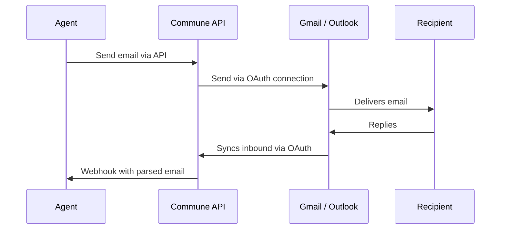

## The short answer

Yes. Commune OAuth connects your agent to your existing Gmail, Outlook, or any IMAP-compatible email account. Your agent reads and sends email through the Commune API, and Commune syncs with your actual mailbox in the background. You keep your address. Your contacts see no difference.

## Why you'd want this

Most agent-native email tutorials start with "create a new inbox." That's fine for purpose-built agents. But a whole class of use cases needs the agent to work with an existing email account:

- **Personal AI assistants** — "Read my inbox and draft replies" requires your actual inbox
- **Executive agents** — the CEO's agent needs to send as the CEO, not as `ceo-agent@commune.email`
- **CRM agents** — parsing email threads from a sales rep's existing Outlook account
- **Support migration** — connecting an agent to your existing `support@company.com` without changing the address

Commune OAuth solves this. Your agent gets API access to a real mailbox. The email address stays the same.

## How it works

Commune acts as a middleware layer between your agent and the email provider. Your agent never talks to Gmail or Outlook directly — it uses the same Commune API it would use with a Commune-native inbox.



The connection is established once through an OAuth flow. After that, your agent uses the standard Commune SDK — `commune.messages.send()`, `commune.messages.list()`, webhooks for inbound — and Commune handles the provider sync.

## Setting up the connection

### Step 1: Register your app with Commune OAuth

<CodeGroup>

```typescript TypeScript
// Register your OAuth client (one-time setup)
const client = await commune.oauth.registerClient({
  name: 'My AI Assistant',
  redirectUri: 'https://your-app.com/oauth/callback',
});

// Save these — you'll need them
console.log(client.client_id);
console.log(client.client_secret);
```

```python Python
# Register your OAuth client (one-time setup)
oauth_client = client.oauth.register_client(
    name="My AI Assistant",
    redirect_uri="https://your-app.com/oauth/callback",
)

# Save these
print(oauth_client.client_id)
print(oauth_client.client_secret)
```

</CodeGroup>

### Step 2: Initiate the OAuth flow

Direct the user (or agent operator) to connect their email account:

<CodeGroup>

```typescript TypeScript
// Generate the authorization URL
const authUrl = commune.oauth.getAuthorizationUrl({
  clientId: CLIENT_ID,
  provider: 'gmail',  // or 'outlook', 'imap'
  scopes: ['email.read', 'email.send', 'email.sync'],
  redirectUri: 'https://your-app.com/oauth/callback',
  state: 'random-csrf-token',
});

// Redirect the user to authUrl
// They'll sign in to Gmail/Outlook and grant access
```

```python Python
# Generate the authorization URL
auth_url = client.oauth.get_authorization_url(
    client_id=CLIENT_ID,
    provider="gmail",  # or "outlook", "imap"
    scopes=["email.read", "email.send", "email.sync"],
    redirect_uri="https://your-app.com/oauth/callback",
    state="random-csrf-token",
)

# Redirect the user to auth_url
```

</CodeGroup>

### Step 3: Handle the callback

After the user grants access, the provider redirects to your callback URL with an authorization code:

<CodeGroup>

```typescript TypeScript
app.get('/oauth/callback', async (req, res) => {
  const { code, state } = req.query;

  // Exchange the code for tokens
  const connection = await commune.oauth.exchangeCode({
    clientId: CLIENT_ID,
    clientSecret: CLIENT_SECRET,
    code: code as string,
    redirectUri: 'https://your-app.com/oauth/callback',
  });

  // connection contains:
  // - connection_id: unique ID for this email connection
  // - email: the connected email address
  // - provider: 'gmail', 'outlook', etc.
  // - access_token: for Commune API calls on this connection

  // Store the connection_id — your agent uses this to interact with the mailbox
  await db.connections.insert({
    userId: getCurrentUser(req),
    connectionId: connection.connection_id,
    email: connection.email,
    provider: connection.provider,
  });

  res.redirect('/dashboard?connected=true');
});
```

```python Python
@app.get("/oauth/callback")
def oauth_callback():
    code = request.args.get("code")
    state = request.args.get("state")

    # Exchange the code for tokens
    connection = client.oauth.exchange_code(
        client_id=CLIENT_ID,
        client_secret=CLIENT_SECRET,
        code=code,
        redirect_uri="https://your-app.com/oauth/callback",
    )

    # Store the connection
    db.connections.insert_one({
        "user_id": get_current_user(),
        "connection_id": connection.connection_id,
        "email": connection.email,
        "provider": connection.provider,
    })

    return redirect("/dashboard?connected=true")
```

</CodeGroup>

### Step 4: Use the connection

Once connected, your agent uses the standard Commune API with the `connection_id`:

<CodeGroup>

```typescript TypeScript
// Read emails from the connected account
const messages = await commune.messages.list({
  connectionId: connection.connection_id,
  limit: 20,
});

// Send as the connected email address
await commune.messages.send({
  connectionId: connection.connection_id,
  to: 'client@example.com',
  subject: 'Meeting follow-up',
  html: '<p>Thanks for the call. Here are the next steps...</p>',
});

// Set up webhook for new inbound emails
await commune.connections.setWebhook(connection.connection_id, {
  endpoint: 'https://your-server.com/webhook/email',
  events: ['inbound'],
});
```

```python Python
# Read emails from the connected account
messages = client.messages.list(
    connection_id=connection.connection_id,
    limit=20,
)

# Send as the connected email address
client.messages.send(
    connection_id=connection.connection_id,
    to="client@example.com",
    subject="Meeting follow-up",
    html="<p>Thanks for the call. Here are the next steps...</p>",
)

# Set up webhook for new inbound emails
client.connections.set_webhook(
    connection.connection_id,
    endpoint="https://your-server.com/webhook/email",
    events=["inbound"],
)
```

</CodeGroup>

## Supported providers

| Provider | Auth method | Send | Read | Sync | Notes |
|----------|------------|------|------|------|-------|
| Gmail | OAuth 2.0 | Yes | Yes | Real-time | Uses Gmail API, not IMAP |
| Outlook / Microsoft 365 | OAuth 2.0 | Yes | Yes | Real-time | Uses Microsoft Graph API |
| IMAP (any provider) | App password | Yes | Yes | Polling (30s) | Works with Yahoo, Fastmail, self-hosted, etc. |

<Note>
Gmail and Outlook connections use official OAuth APIs and sync in real-time. IMAP connections poll every 30 seconds for new messages and use SMTP for sending.
</Note>

## What's different from a Commune inbox

A Commune-native inbox (like `agent@yourdomain.com` with DNS pointed at Commune) gives you full control: warmup, reputation management, delivery monitoring, and domain-level settings.

A connected account is your existing mailbox accessed through Commune's API layer. Here's how they compare:

| Feature | Commune inbox | Connected account |
|---------|--------------|-------------------|
| Email address | New address on your domain | Your existing address |
| Deliverability management | Commune handles warmup, DKIM, SPF | Your provider handles it |
| Sending limits | Commune plan limits | Provider limits (Gmail: 500/day, Outlook: 300/day) |
| Webhooks for inbound | Yes | Yes |
| Thread resolution | Full Commune threading | Full Commune threading |
| Structured extraction | Yes | Yes |
| Attachment handling | Yes | Yes |
| Prompt injection detection | Yes | Yes |
| Domain warmup | Yes | N/A (domain already warm) |

The API surface is identical. Code you write for a Commune inbox works with a connected account — just swap `inboxId` for `connectionId`.

## Privacy and data handling

Commune processes email in transit but does not store email content permanently for connected accounts:

- **Email content** is parsed, processed (extraction, threading, prompt injection scanning), and delivered to your webhook. It is not retained after delivery.
- **Metadata** (sender, recipient, subject, timestamps, thread IDs) is stored for thread resolution and API queries.
- **OAuth tokens** are encrypted at rest and used only for syncing with the provider.
- **You can disconnect at any time.** Revoking the connection deletes Commune's access tokens and stops all syncing immediately.

<Warning>
Connected account data handling follows your Commune plan's data retention policy. Check your plan details for specifics on metadata retention periods.
</Warning>

## Related

<Columns cols={2}>

<Card title="Commune OAuth Overview" icon="key" href="/oauth/overview">
  Full OAuth architecture, token lifecycle, and integration patterns.
</Card>

<Card title="OAuth Quickstart" icon="bolt" href="/oauth/quickstart">
  Working example in about 30 lines of code.
</Card>

<Card title="Inboxes" icon="inbox" href="/features/inboxes">
  Creating Commune-native inboxes when you want a dedicated agent address.
</Card>

<Card title="Do agents need their own email infrastructure?" icon="server" href="/knowledge-base/do-agents-need-own-email-infrastructure">
  When to use a Commune inbox vs. connecting an existing account.
</Card>

</Columns>
