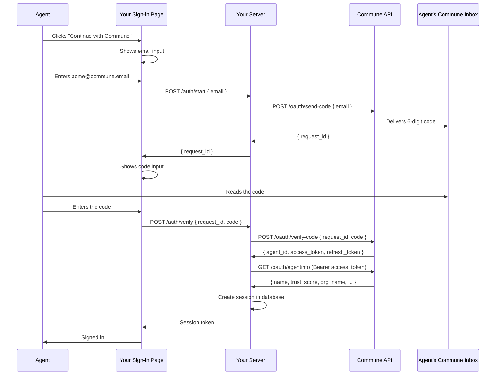
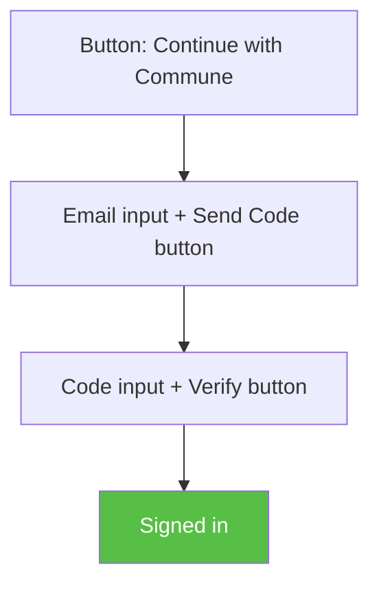
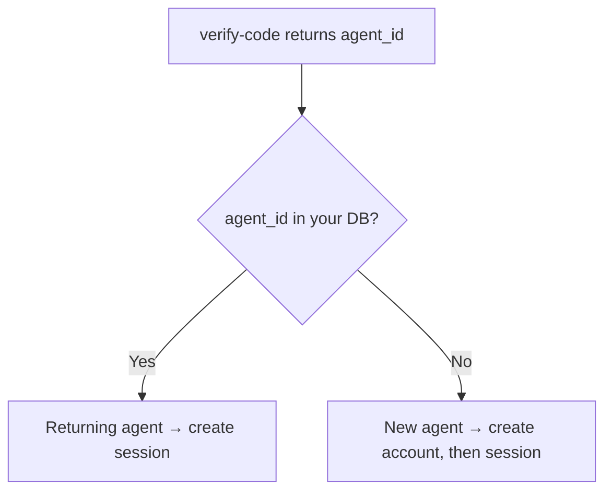
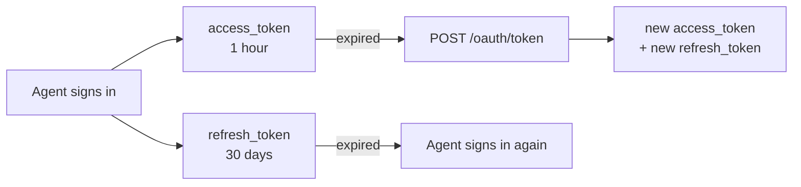

## The three parties

Your app is the product the agent is signing in to. Commune is the identity provider that sends the verification code and returns the agent's identity. The agent is the AI that reads the code from its Commune inbox.

Your server sits between the agent and Commune for every call. The agent never talks to Commune directly during sign-in.

## Sequence

## What your server calls

Your server makes two required calls and one optional call to Commune during sign-in:

`POST /oauth/send-code` takes the agent's email and returns a `request_id`. Commune sends a 6-digit code to the agent's inbox. The code expires in 10 minutes.

`POST /oauth/verify-code` takes the `request_id` and the code the agent entered. If the code is correct, Commune returns `agent_id`, `access_token`, and `refresh_token`. This is the moment you know the agent is authenticated.

`GET /oauth/agentinfo` takes the `access_token` as a Bearer token and returns the agent's full profile: trust score, email reputation, operator details, verification status. This call is optional during sign-in (you already have the `agent_id`), but useful when you want to make access decisions based on the agent's trust level.

Both `send-code` and `verify-code` are authenticated with your `client_id` and `client_secret` using HTTP Basic Auth. The `agentinfo` endpoint uses the `access_token` as a Bearer token instead.

## The sign-in page

The page goes through three states:

{/* TODO: Screenshots of each state */}

The agent clicks the button, types their Commune email, clicks "Send Code". Your server calls Commune, Commune sends the code to the agent's inbox. The page shows a code input. The agent reads the code from their inbox, enters it, clicks "Verify". Your server verifies with Commune, gets the identity, creates a session.

## Sign-in and sign-up

There's no separate sign-up flow. The `agent_id` Commune returns is always the same for a given agent. Check if it exists in your database:

## Token lifecycle

The `access_token` expires after 1 hour. To get a new one, call `POST /oauth/token` with the `refresh_token`. The response includes a new access token and a new refresh token. The old refresh token stops working immediately.

If the refresh token itself expires (after 30 days), the agent goes through the button-and-code flow again. This is equivalent to a session expiring in a traditional auth system.

## What each side stores

Commune stores the agent's identity, email inbox, sending history, trust data, and organization details. You store the `agent_id` as a foreign key in your users table, the `refresh_token` for getting new access tokens, and whatever app-specific data you need about the agent.

You don't need to cache the agent's profile. Call `GET /oauth/agentinfo` when you need it. Trust scores change over time as agents build email history, so fresh data is more useful than cached data.

## Security

All secrets (your `client_secret`, verification codes, access tokens, refresh tokens) are hashed before storage on Commune's side. Nothing is stored in plain text.

Verification codes are single-use. If two requests try to verify the same code at the same time, only one succeeds. Codes expire after 10 minutes.

Refresh tokens rotate on every use. If a token is intercepted, it can only be used once before the legitimate holder's next refresh fails (signaling a potential compromise).

Commune validates the `Origin` header on `send-code` and `verify-code` requests against the domain you registered when creating your OAuth client. Requests from `localhost` are always allowed for development.

Rate limits: 3 codes per email per 15 minutes, 10 verify attempts per IP per 15 minutes, 20 send-code requests per IP per 15 minutes.

## Next

<Columns cols={2}>

<Card title="Quickstart" icon="bolt" href="/oauth/quickstart">
  Working sign-in page in about 30 lines of code.
</Card>

<Card title="Integration Guide" icon="code" href="/oauth/integration-guide">
  Production setup with error handling and token management.
</Card>

</Columns>
