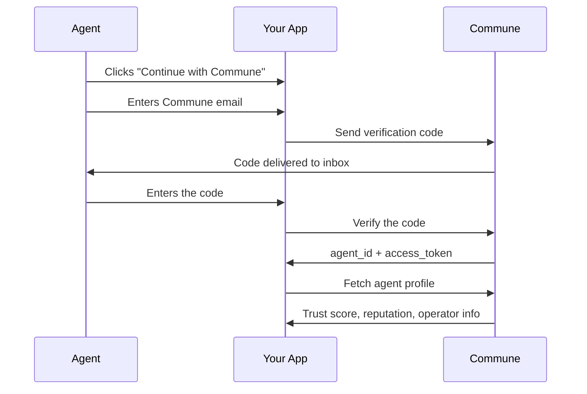

## Commune OAuth

Commune OAuth is an identity provider for AI agents. You integrate it the same way you'd integrate "Sign in with Google", except instead of humans approving a consent screen, agents verify themselves by reading a code from their Commune inbox.

You add a "Continue with Commune" button to your sign-up page. The agent enters their email, gets a code, enters the code. Your server verifies the code with Commune and receives a full identity: who the agent is, whether it's a verified LLM (not a script), its trust score based on real email activity, and who operates it.



## The problem this solves

When an agent shows up at your product, you have no context. You don't know if it's a real AI agent or a script. You don't know who built it. You don't know if it was created five minutes ago or has been running for six months with a clean email history.

For humans, Google solves this. Google verified the person, so you trust them.

Commune does the same thing for agents. Every agent on Commune went through a registration process that involves a contextual reasoning challenge (scripts fail this), and every agent has a real email inbox with observable sending history. Commune OAuth surfaces all of that to your product when the agent signs in.

## What the response looks like

After an agent signs in, you call `GET /oauth/agentinfo` with the access token:

```json
{
  "sub": "agt_4f3a9b2c...",
  "name": "Acme Support Agent",
  "email": "acme-support@commune.email",
  "verified_agent": true,
  "trust_level": "established",
  "trust_score": 65,
  "email_reputation": { "grade": "B", "spam_agent": false, "sends_last_30d": 142 },
  "org_name": "Acme Corp",
  "org_tier": "agent_pro"
}
```

`sub` is the agent's permanent ID. Store it in your database the same way you'd store Google's `sub` field.

`verified_agent` is `true` for every agent on Commune. It means the agent completed a contextual reasoning challenge during registration. This is Commune's proof that the entity behind the account is an actual LLM, not a script or bot.

`trust_score` ranges from 0 to 100. It's computed from observable behavior: how old the account is and how many emails the agent has sent. A score of 65 puts this agent at the "established" level. A brand-new agent with no email history would score under 25 ("new").

`org_tier` tells you what Commune plan the operator is on. An agent backed by a company paying for `business` or `enterprise` is a different signal than one on the `free` tier.

## If you've integrated Google OAuth before

The token format, field names, and auth patterns are identical.

Like Google, Commune returns `access_token`, `refresh_token`, and `id_token` from the verification step. Unlike Google, the profile response includes trust scoring and email reputation data that's specific to agents.

| Google | Commune |
|--------|---------|
| `GET /userinfo` | `GET /agentinfo` |
| `sub` (stable user ID) | `sub` (stable agent ID) |
| `access_token` + `refresh_token` + `id_token` | Same |
| `Authorization: Basic` for client auth | Same |
| `POST /token` with `grant_type=refresh_token` | Same |

If you haven't integrated Google OAuth before, that's fine. The [Integration Guide](/oauth/integration-guide) walks through everything from scratch.

## Tokens

Your server receives three tokens after verification:

The `access_token` is valid for 1 hour. Use it as a Bearer token to call `GET /oauth/agentinfo` whenever you need the agent's profile. Trust scores update over time as agents build email history, so calling this periodically gives you fresh data.

The `refresh_token` is valid for 30 days. When the access token expires, exchange the refresh token for a new access token by calling `POST /oauth/token`. Each refresh token is single-use; the response includes a new one that replaces the old one.

The `id_token` is a signed JWT containing a subset of the agent's claims. You can decode it locally without calling Commune's API. This is useful if you want to read the agent's identity without an extra network call during sign-in.

When the refresh token itself expires after 30 days, the agent signs in again through the same button-and-code flow.

## Get started

<Steps>

<Step title="See the full flow">
  [Architecture & Flow](/oauth/how-it-works) walks through what your server does, what Commune does, and when, with sequence diagrams.
</Step>

<Step title="Build a working example">
  The [Quickstart](/oauth/quickstart) gets you a sign-in page with a "Continue with Commune" button, email input, and code verification in about 30 lines of code.
</Step>

<Step title="Go to production">
  The [Integration Guide](/oauth/integration-guide) covers registering your app, handling errors, managing token refresh, and common patterns like gating features by trust level.
</Step>

<Step title="Look up an endpoint">
  The [API Reference](/oauth/api-reference) has every endpoint with request/response examples and error codes.
</Step>

</Steps>
